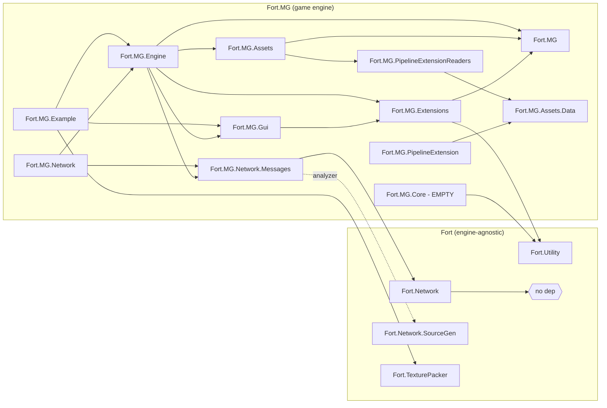
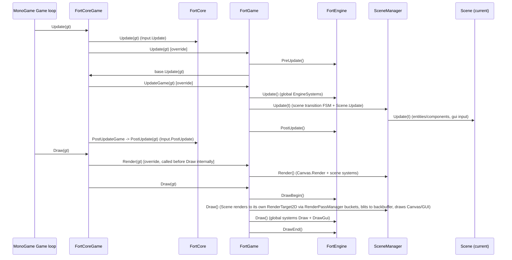

# AI_CONTEXT.md — Fort.MG / Fort

> Generated by static analysis of the source (no source files were modified to produce this document).
> Scope: **two git repositories** opened together in this workspace:
> - `Fort.MG/` — a MonoGame-based 2D game engine framework (`Fort.MG.sln`)
> - `Fort/` — reusable, engine-agnostic .NET libraries consumed by Fort.MG (`Fort.sln`)
>
> This file is meant to give an AI agent (or a new maintainer) enough context to work safely in
> either repository without re-deriving the architecture from scratch.

## 1. Overview

`Fort.MG` is a custom 2D game engine built on top of **MonoGame 3.8.4 (DesktopGL)**, targeting
**.NET 10**. It is organized as many small, single-purpose class libraries wired together through
project references, with a thin static-facade layer (`FortCore` / `FortEngine`) that consumer
games call into. `Fort.MG.Example` is the reference/demo game.

`Fort` is a separate, MonoGame-agnostic repository providing the low-level primitives Fort.MG
reuses: a LiteNetLib-based networking layer with Roslyn source-generated struct serialization, a
math/rng/object-pooling utility library, and an offline texture-packing tool. Fort.MG references
these projects directly via relative `ProjectReference` paths (`..\Fort\...`), i.e. **the two repos
must be checked out as sibling folders** for Fort.MG to build.

No automated test projects exist in either solution — there is no regression safety net for
refactors.

## 2. Solution & Project Map

### `Fort/Fort.sln` (net10.0, Nullable enabled, no MonoGame dependency)

| Project | Purpose | Key external deps |
|---|---|---|
| `Fort.Utility` | Math/RNG/pooling/JSON helpers used everywhere | *(none)* |
| `Fort.Network` | Transport-agnostic-ish message networking on top of LiteNetLib | `LiteNetLib` |
| `Fort.Network.SourceGen` | Roslyn source generator: emits `Serialize`/`Deserialize` for `[NetData]` structs | `Microsoft.CodeAnalysis.CSharp` (netstandard2.0 analyzer project) |
| `Fort.TexturePacker` | Packs a folder of PNGs into one atlas + JSON region data | `RectpackSharp`, `System.Drawing.Common` |

### `Fort.MG/Fort.MG.sln` (net10.0, Nullable enabled via `Directory.Build.props`, MonoGame.Framework.DesktopGL 3.8.4 injected into every project)

| Project | Purpose | Key deps |
|---|---|---|
| `Fort.MG` | Thin MonoGame `Game` wrapper: window/graphics/input/screen bootstrapping | `Fort.Utility` |
| `Fort.MG.Core` | **Empty project** — csproj only references `Fort.Utility`, contains zero source files | `Fort.Utility` |
| `Fort.MG.Extensions` | MonoGame-flavored helpers (direction↔vector conversions, line/rect drawing, RNG) | `Fort.Utility`, `Fort.MG` |
| `Fort.MG.Assets.Data` | Plain data contracts shared by the content pipeline (sprite/tileset atlas records) | *(none)* |
| `Fort.MG.PipelineExtension` | **Build-time** MonoGame Content Pipeline importer/processor for JSON/sprite/tileset assets | MonoGame.Framework.Content.Pipeline, `RectpackSharp`, `System.Drawing.Common` |
| `Fort.MG.PipelineExtensionReaders` | **Runtime** counterpart: `ContentTypeReader`s for the above | `Fort.MG.Assets.Data` |
| `Fort.MG.Assets` | `AssetManager` + typed asset storages (fonts, sounds, textures, atlases) | `Fort.MG.PipelineExtensionReaders`, `Fort.MG`, `FontStashSharp.MonoGame` |
| `Fort.MG.Gui` | Retained-mode UI toolkit (controls, skins, canvas, focus/input handling) | `Fort.MG.Extensions` |
| `Fort.MG.Network.Messages` | Game-specific `[NetData]` message struct definitions | `Fort.Network`, `Fort.Network.SourceGen` (as analyzer) |
| `Fort.MG.Engine` | **The core engine**: ECS-ish entities, scenes, states, rendering, tilemaps, particles | `Fort.MG.Assets`, `Fort.MG.Extensions`, `Fort.MG.Gui`, `Fort.MG.Network.Messages`, `Fort.MG`, `YamlDotNet` |
| `Fort.MG.Editor` | In-game entity editor: browses, edits, and saves the data-driven entity templates (`content/templates/*.yaml`) | `Fort.MG.Engine`, `Fort.MG.Gui` |
| `Fort.MG.Network` | Game-level networking glue over `Fort.Network` | `LiteNetLib`, `Fort.MG.Engine`, `Fort.MG.Network.Messages` |
| `Fort.MG.Example` | Sample/demo game executable + custom content type reader example | `Fort.TexturePacker`, `Fort.MG.Engine`, `Fort.MG.Gui`, `Nopipeline.Task`, `MonoGame.Content.Builder.Task` |

## 3. Dependency Graph

`Fort.MG.Core` is disconnected from the rest of the dependency graph — nothing references it, and
it contains no source files of its own.

## 4. Layered Architecture (narrative)

1. **`Fort.Utility`** — zero-dependency leaf: RNG, math helpers, object pooling, JSON load/save,
   id pools, small LINQ-avoidance extensions.
2. **`Fort.Network` + `Fort.Network.SourceGen`** — struct-based binary messaging over LiteNetLib.
   Consumers write `partial struct` message types marked `[NetData]`; the source generator emits
   the `Serialize`/`Deserialize` boilerplate at compile time.
3. **`Fort.MG` (core)** — wraps a MonoGame `Game` instance behind static facades (`FortCore`,
   `Graphics`, `Input`, `Screen`) and defines `IGameContext` (a `Delta`/`TotalGameTime` abstraction
   used everywhere instead of MonoGame's `GameTime` directly).
4. **Mid-layer libraries** (parallel, not depending on each other): `Fort.MG.Extensions` (math/draw
   helpers), the **asset pipeline** (`Fort.MG.Assets.Data` → `Fort.MG.PipelineExtension` (build) /
   `Fort.MG.PipelineExtensionReaders` (runtime) → `Fort.MG.Assets`), `Fort.MG.Gui` (UI toolkit), and
   `Fort.MG.Network.Messages` (game message contracts).
5. **`Fort.MG.Engine`** — the actual game engine: entity/component model, scene management, state
   machines, rendering passes, tilemaps, particles — composes all mid-layer libraries.
6. **Top layer**: `Fort.MG.Network` (networking glue for game entities) and `Fort.MG.Example` (the
   runnable demo game and reference implementation for consumers).

## 5. Key Subsystems & Important Classes

### Fort.Utility
- `Rng` / `FortRandom` — static + instance RNG facade (seeded, ranges, weighted choose, shuffle-pop).
- `FortMath` — degrees/radians, lerp, clamp, angle interpolation helpers.
- `IdPool` / `IdPool16S` / `IdPool8` — reusable integer id allocators (get/return) at different widths.
- `PoolManager<T>` / `IPool` — static generic object pool with `Spawn()`/`Free()` and pool-aware callbacks.
- `JsonHelper` — `Load<T>`/`Save<T>` thin wrapper over `System.Text.Json`.

### Fort.Network / Fort.MG.Network.Messages
- `IMessage : INetSerializable` — marker interface for all wire messages.
- `NetDataAttribute` — marks a `partial struct` for the source generator.
- `MessageFactory` — reflection-scans assemblies for `IMessage` structs, assigns each a `byte` id,
  and builds struct constructors via `DynamicMethod`/IL emit (avoids `Activator.CreateInstance` cost).
- `MessageListener` — pub/sub dispatch (`Sub<T>`/`UnSub<T>`) plus a **dedicated background thread**
  that polls `NetManager.PollEvents()` at a configurable `PollFrequency`.
- `NetBase` / `NetServer` / `NetClient` — connection lifecycle wrappers around LiteNetLib's `NetManager`.
- `Fort.Network.SourceGen.MessageSourceGenerator` — legacy `ISourceGenerator` that emits
  `Serialize`/`Deserialize` for `[NetData]` partial structs (switches on primitive field type names;
  falls back to calling `.Serialize()`/`.Deserialize()` on nested types).
- Example messages (`Fort.MG.Network.Messages/Messages.cs`): `EntitySpawnMessage`,
  `EntityRemoveMessage`, `EntityPositionMessage`, `EntityPositionSmoothMessage`, `EntityStateMessage`.

### Fort.MG (core)
- `FortCoreGame : Game` — MonoGame `Game` subclass exposing overridable
  `UpdateGame`/`PostUpdateGame`/`Render` hooks in addition to the standard `Initialize`/`LoadContent`/`Update`/`Draw`.
- `FortCore` (static) — owns the `Game` reference, drives `Input.Update`/`PostUpdate`, exposes
  `WindowSizeChanged`.
- `Graphics`, `Input`, `Screen` (static) — graphics device/spritebatch, input polling, resolution/vsync config.
- `IGameContext` — `Delta`/`TotalGameTime` (+ `double` variants) abstraction passed through the engine instead of `GameTime`.

### Fort.MG.Engine — Engine core
- `FortEngine` (static facade) — global `SceneManager`, `AssetManager` (`Assets`), `EngineSystemManager`,
  camera accessor (`Cam`), and the `Load`/`PreUpdate`/`Update`/`PostUpdate`/`Draw` pipeline invoked by `FortGame`.
- `FortGame : FortCoreGame` — the class **consumers subclass** to build a game; wires `FortEngine` and
  `SceneManager` into the MonoGame lifecycle.
- `Systems/EngineSystem` + `EngineSystemManager` — pluggable global systems with
  `PreUpdate`/`Update`/`PostUpdate`/`Draw`/`DrawGui`/`OnDrawBegin`/`OnDrawEnd` hooks, registered via
  `FortEngine.RegisterSystem<T>()` / retrieved via `GetSystem<T>()`. Built-ins: `TimerSystem`,
  `PerformanceMetricsSystem`, `SystemMessageSystem`, `CanvasSystem`, `DebugPrinter`, `TaskNotifierSystem`.
- `EntitySystem/Entity`, `Component`, `EntityManager`, `EntityCollection` (impl: `BasicEntityCollection`),
  `EntityRegistry`, `Transform` — lightweight entity/component model. `BaseObject` defines the shared
  `Init → Start → Update → Destroy` lifecycle used by both `Entity` and `Component`. `EntityRegistry`
  maps data-driven template names ↔ `byte` type ids ↔ template file paths (see `EntitySystem/Parsing/`).
- `Scenes/Scene` (+ `BaseScene`), `SceneManager`, `LoadingScene` — scene state machine
  (`Entering → Active → Exiting → Exited`), each `Scene` owning its own `EngineSystemManager`
  (`SceneSystemManager`), `EntityManager`, `CanvasSystem`, `Camera`, and a dedicated `RenderTarget2D`.
- `StateEngine/State`, `StateManager` — a **separate, generic** state machine
  (`Starting → Updating → Exiting`) for game/gameplay-level state, independent of `Scene`.
- `Rendering/RenderPass`, `RenderPasses`, `RenderPassManager` — buckets renderables by render
  pass/blend state so `Scene.Draw()` can batch `SpriteBatch.Begin/End` calls efficiently.
- `Renderers/TileMapRenderer`, `CircleRenderer` — chunk-based tilemap rendering with a per-layer
  render cache (`TileRenderLayerCache`) and simple shape rendering.
- `TilemapEngine/TileMap`, `TileDataManager`, `TileMapAutoTiler`, `TileHelper`,
  `WeightedVariantSelector` — tile data storage, chunking, and rule-based auto-tiling.
- `ParticleEngine/ParticleEngine`, `ParticleEmitter`, `EmitterData`, `Particle`, `ParticleData`,
  `EmitterStates/` — data-driven particle effects.
- `Components/Camera`, `CameraFollower`, `DefaultCameraControls`, `Body`, `Sprite` — built-in
  engine components attachable to `Entity`.
- `Threading/TaskNotifier`, `TaskNotifierManager` (+ `Systems/TaskNotifierSystem`) — background-task
  completion notification bridged back onto the main/update thread.
- `Utils/FortTimer`, `Time`, `Life`, `TextureFactory` — timers, the `IGameContext` time source, and
  a simple "lifetime/HP"-style helper.
- `JsonConverters/` and `YamlConverters/` — custom `System.Text.Json`/`YamlDotNet` converters for
  `Color`, `Rectangle`, `Vector2`, `SpriteRegion`, and (YAML only) cross-referenced data objects —
  used for data-driven entity templates and tileset/atlas config.

### Fort.MG.Gui
- `ComponentBase` / `GuiComponent` (partial across `GuiComponent.cs`, `.Components.cs`, `.Events.cs`,
  `.Skin.cs`) — base UI element with `Position`/`Size`/`Bounds`, `Style`, skins, and the
  `Update`/`UpdateInput`/`Draw` lifecycle.
- `Canvas` — root UI container rendered/updated by `CanvasSystem` in `Fort.MG.Engine`.
- `Controls/` — concrete widgets: `Button`, `Checkbox`, `Dropdown`, `EditLabel`, `Image`, `Label`,
  `ListBox`, `Slider`, `StackPanel`, `TextBox`, `Window`, plus `DragControl`/`InteractiveComponent`
  base behaviors and a `Skins/` folder for visual theming.
- `FocusManager`, `KeyRepeater`, `StyleManager`, `GuiSettings`, `GuiContent`, `Markdowns` — supporting
  input-focus, key-repeat, styling, and markdown-text rendering helpers.

### Fort.MG.Editor
- `EntityEditorSystem : EngineSystem` — owns an editor `Canvas`; registered via
  `FortEngine.RegisterSystem<EntityEditorSystem>()` and toggled with **F1**. Exposes `RenderGui()` /
  `DrawGui()`, which must be called where no `SpriteBatch` is active (it is deliberately *not* an
  `IFortDrawableGui`, because the global `DrawGui` pass runs inside an ambient batch). While closed
  it updates and draws nothing.
- `EntityEditorSession` — the working (scene-detached) entity tree, selection, dirty flag, and
  YAML-snapshot undo/redo. Load/save go through `EntitySerializer`; the working tree is built with
  `Entity.Create` + `Parent`, never `Entity.Instantiate`, so editing cannot leak entities into the
  running scene.
- `Panels/` — `ToolbarPanel`, `TemplateBrowserPanel`, `HierarchyPanel`, `InspectorPanel`, and
  `EditorPreview` (gizmo viewport: click to select, drag to move).
- `Fields/` — `ComponentFieldModel` (cached, reflection-derived editable fields per component type,
  reusing `ComponentSerializer`'s discovery/naming rules) and `PropertyRow` / `FieldWidgets` (the
  type→widget mapping: bool→Checkbox, enum→Dropdown, numeric→TextBox, Vector2/3→numeric row,
  Color→swatch + RGBA boxes; types it cannot safely author render read-only).
- Additive engine seams it relies on: public `ComponentSerializer.GetSerializableMembers` /
  `GetSerializationName` / `GetMemberType` / `GetMemberValue` / `SetMemberValue`;
  `EntitySerializer.SerializeEntityTemplates` / `DeserializeEntityTemplates` / `SerializeTemplates`
  and public `CreateTemplateFromEntity`; `EntityDatabase.GetAllTemplateNames` / `GetTemplatePath`.

### Fort.MG.Assets / pipeline
- `Fort.MG.Assets.Data`: `SpriteAtlas`/`SpriteRegion`, `TilesetAtlas`/`TilesetRegion` — plain data
  contracts shared between build-time and runtime.
- `Fort.MG.PipelineExtension` (build-time, MonoGame Content Pipeline): `JsonImporter`, `JsonProcessor`,
  `JsonProcessResult`, `JsonTypeWriter`, plus `SpriteAtlas/` and `Tileset/` importer/processor pairs.
- `Fort.MG.PipelineExtensionReaders` (runtime): `JsonTypeReader`, `SpriteAtlasReader`, `TilesetAtlasReader`.
- `Fort.MG.Assets.AssetManager` + `Storage/BaseStorage`, `FontStorage`, `SoundStorage`,
  `SpriteAtlasStorage`, `TextureStorage`, `TileAtlasStorage`, `IAssetStorage` — typed asset caches
  loaded through the MonoGame `ContentManager` + the readers above.

### Fort.TexturePacker (Fort repo)
- `TexturePacker` — packs all PNGs in a source folder via `RectpackSharp.RectanglePacker`, draws
  them onto one `Bitmap` (`System.Drawing.Common`), writes atlas PNG + JSON (`TextureAtlas`/`TextureRegion`).
  Used by `Fort.MG.PipelineExtension`/`Fort.MG.Example` at content-build time (separate from the
  runtime `Fort.MG.Assets.SpriteAtlasStorage` consumption path).

## 6. Public API / Extension Points (how a consumer game uses this engine)

- Subclass **`FortGame`** as the game's entry `Game` type (see `Fort.MG.Example.ExampleGame`).
- Call **`FortEngine.RegisterSystem<T>()`** to add custom global systems (`EngineSystem` subclasses);
  retrieve with **`FortEngine.GetSystem<T>()`**.
- Subclass **`Scene`** to define game screens/worlds; call **`SceneManager.SetScene(...)`** to
  transition (queues if a scene is currently active, animated via `EnterTime`/`ExitTime`).
- Subclass **`State`** + use a **`StateManager`** for gameplay-level state machines independent of scenes.
- Create `Entity` instances via `Entity.Create<T>()`/`AddComponent<T>()`; subclass `Component` for
  custom behavior/rendering (implement `IFortRenderable`/`IFortDrawable`/`IFortDrawableGui` as needed).
- Author `[NetData] partial struct` message types (in a project referencing `Fort.Network` +
  `Fort.Network.SourceGen` as an analyzer) to add new wire messages; subscribe via
  `MessageListener.Sub<T>(...)`.
- Author custom `GuiComponent`/`Controls` subclasses for UI; skins live under `Fort.MG.Gui/Controls/Skins`.
- Add new asset types by following the `Importer`/`Processor`/`Writer` (build-time,
  `Fort.MG.PipelineExtension`) + `ContentTypeReader` (runtime, `Fort.MG.PipelineExtensionReaders`) +
  `Storage` (`Fort.MG.Assets/Storage`) pattern already used for sprite atlases and tilesets.

## 7. Runtime Lifecycle

### Per-frame Update/Draw call chain

### Object/state lifecycles

- **Entity/Component** (`BaseObject`): `Init()` (once, on creation) → `Start()` (first `Update` call)
  → `Update(t)` (every frame) → `Destroy()` sets `MarkedForDestroy` → `OnDestroyed()` (unregisters
  from renderable lists, clears components).
- **Scene** (`SceneStates`): `Entering` (fade-in over `EnterTime`) → `Active` → `Exiting` (fade-out
  over `ExitTime`) → `Exited` → `SceneManager` promotes the next queued scene (or a default scene
  via `Activator.CreateInstance` if none is queued).
- **State** (`StateEngine`, independent of Scene): `Starting` (timed) → `Updating` → `Exiting`
  (timed) → cleared; `StateManager` falls back to a registered default state type if nothing is queued.
- **Networking message**: struct decorated `[NetData] partial struct` → source generator emits
  `Serialize`/`Deserialize` → `MessageFactory.RegisterAssembly<T>()` assigns each type a `byte` id by
  **assembly reflection scan order** → `NetServer`/`NetClient.SendMessage` writes id + payload via
  `NetDataWriter` → `MessageListener`'s background thread polls `NetManager.PollEvents()` at
  `PollFrequency` Hz, queues decoded messages thread-safely → the game loop's `MessageListener.Update()`
  drains the queue and invokes `Sub<T>()` handlers.

## 8. Dependencies

### External NuGet packages
| Package | Used by | Notes |
|---|---|---|
| `LiteNetLib` 2.0.2 | `Fort.Network`, `Fort.MG.Network` | UDP transport for messaging |
| `Microsoft.CodeAnalysis.CSharp` 4.5.0 | `Fort.Network.SourceGen` | Roslyn source generator host |
| `RectpackSharp` 1.2.0 | `Fort.TexturePacker`, `Fort.MG.PipelineExtension` | Rectangle bin-packing for atlases |
| `System.Drawing.Common` | `Fort.TexturePacker` (9.0.1), `Fort.MG.PipelineExtension` (8.0.10) | GDI+-based bitmap composition — Windows-oriented; **version mismatch between the two projects** |
| `MonoGame.Framework.DesktopGL` 3.8.4 | virtually every Fort.MG project (via `Directory.Build.props`) | Rendering/windowing/input |
| `MonoGame.Framework.Content.Pipeline` 3.8.4 | `Fort.MG.PipelineExtension` | Build-time content pipeline API |
| `MonoGame.Content.Builder.Task` | `Fort.MG.Example` | MSBuild content build integration |
| `FontStashSharp.MonoGame` 1.3.10 | `Fort.MG.Assets` | Font rendering |
| `YamlDotNet` 16.3.0 | `Fort.MG.Engine` | Data-driven config/template parsing |
| `Nopipeline.Task` 2.3.0 | `Fort.MG.Example` | Alternative/simplified content build task |

### Inter-repo / external path dependency (risk)
`Fort.MG.sln` also references two projects at `..\..\Clones\Nopipeline\Nopipeline\...`
(`Nopipeline.Task`, `Nopipeline`) — a **sibling repository outside this workspace**, not inspectable
from here. This is a fragile, machine-specific path dependency (see Risks §9.1).

## 9. Risks & Technical Debt

1. **External sibling-repo path dependency.** `Fort.MG.sln` references
   `..\..\Clones\Nopipeline\Nopipeline\...` — requires an exact, undocumented sibling checkout
   layout on every dev/CI machine. Not portable, not reproducible from either repo alone.
2. **`Fort.MG.Core` is empty** — the csproj exists and references `Fort.Utility`, but contains zero
   source files and nothing else in the solution references it. Likely dead/vestigial; unclear
   intended purpose.
3. **Pervasive static/singleton global state**: `FortEngine`, `FortCore`, `Graphics`, `Input`,
   `Screen`, `Rng` are all static facades over mutable global state. This makes unit testing,
   headless execution, and running multiple game/engine instances in one process impractical, and
   creates implicit coupling that's easy to break unknowingly.
4. **`MessageFactory` wire-id assignment is order-dependent.** Byte ids for `IMessage` structs are
   assigned by iterating `assembly.GetTypes()` in whatever order reflection returns them, with no
   explicit ordering, versioning, or stability guarantee. If client and server binaries are built
   from slightly different assemblies (extra message types, different compiler/runtime), ids can
   silently diverge — causing message payloads to be decoded as the wrong type at runtime, with no
   protocol version check to catch it.
5. **`Fort.Network.SourceGen` uses the legacy `ISourceGenerator` API**, not the modern
   `IIncrementalGenerator`. This is less efficient (regenerates on every compilation, no per-node
   caching) and is the API Roslyn/community guidance has moved away from.
6. **`MessageListener`'s background polling thread has no graceful cancellation.** It's a raw
   `Thread` looping on `_base.IsRunning` with `Thread.Sleep`-based pacing — no `CancellationToken`
   and no `Join()` on stop, so rapid start/stop cycles risk races or a lingering thread.
7. **`System.Drawing.Common` dependency** in `Fort.TexturePacker` and `Fort.MG.PipelineExtension`
   for bitmap composition — historically GDI+-backed and effectively Windows-only for image
   operations since .NET 6+, a cross-platform build risk for anyone building content on Linux/macOS.
   The two projects also pin **different versions** (9.0.1 vs 8.0.10) of the same package.
8. **No automated tests** exist in either solution (`Fort.sln` or `Fort.MG.sln`) — refactors have
   no regression safety net beyond manual play-testing via `Fort.MG.Example`.
9. **Minor inconsistency**: several Fort.MG sub-projects explicitly redeclare
   `TargetFramework`/`Nullable`/`ImplicitUsings` in their own `.csproj` even though
   `Directory.Build.props` already sets these for the whole tree — harmless, but redundant and a
   maintenance nit if the two ever drift.

## 10. Appendix — Raw Project Reference Data

See `Fort.MG.sln` / `Fort.sln` and each project's `.csproj` `<ProjectReference>`/`<PackageReference>`
items for the authoritative, current dependency list; the tables in §2/§8 above summarize the state
as of this document's generation and should be re-verified if `.csproj` files change materially.

---

> **The sections below (§11+) are prescriptive** — rules and conventions for how this codebase
> should be worked on going forward. They are not auto-generated from the current code, and they
> are not always a description of current reality (see §9 for that). Where a rule here contradicts
> something described in §9, both are intentionally kept: §9 describes what *is*, this section
> describes what's *intended*.

## 11. Project Comments

- Rendering is strictly 2D (sprite-based, orthographic). Entity/world positions use X, Y, Z, but Z
  is mostly cosmetic (draw-order/layering, parallax-style offsets) — not a real 3D projection.
  Collision, physics, and gameplay logic should stay 2D (X,Y) unless a task explicitly says
  otherwise.
- Target architecture: a server process must be able to host multiple concurrent, isolated game
  instances ("lobbies"), each running its own simulation in the same process. This is a first-class
  requirement and affects the static-state guidance in §12.

## 12. Design Principles

Performance priority order (highest first):
1. Correctness
2. Deterministic behavior
3. Readability
4. Performance (optimize hot paths)
5. Low allocations

General principles:
- Keep systems loosely coupled.
- Favor readability over micro-optimizations unless profiling justifies them.
- Avoid allocations during `Update()` and `Draw()`.
- Favor explicit code over clever abstractions.
- Minimize dependencies. Prefer the standard library.
- Only introduce external dependencies when they provide significant long-term value.
- Do not introduce NuGet packages without explicit approval.
- APIs should remain stable.
- Prefer composition over inheritance.
- Threading should be explicit. Most engine code assumes execution on the main thread.
- Generic code belongs in `Fort`. MonoGame-specific code belongs in `Fort.MG`.

### Static facades — known issue, not intentional design

Static facades over mutable global state (`FortEngine`, `SceneManager`, `Rng`, `EntityManager`,
etc. — see §9.3) were an oversight, not a deliberate design choice, and they conflict with the
multi-lobby hosting requirement in §11: two concurrent lobbies in one process cannot safely share
the same static simulation state.

Going forward:
- Statics representing a genuine one-per-process resource (`GraphicsDevice`, `SpriteBatch`,
  `Screen`, client-side `Input`) may remain static — a client only ever runs one instance, same as
  Unity's model.
- Anything representing *simulation* state that must be isolated per game instance
  (`SceneManager`, `EntityManager`/`EntityRegistry`, `Rng`, `FortEngine`'s system manager) should
  move toward being owned by an explicit, instantiable context (e.g. a `GameInstance`/`World`
  object) passed through Update/Draw, rather than accessed ambiently.
- Do not introduce a DI container or `IServiceProvider` to achieve this — pass the
  instance/context explicitly instead. This also improves testability without adding DI machinery.
- This is a real, nontrivial refactor. Don't attempt it opportunistically inside unrelated tasks —
  treat it as its own planned work item, and ask before starting it.

### Testability

- Favor code shaped so it *can* be unit tested (explicit dependencies, small pure functions,
  avoiding ambient static access in new simulation code) — but readability stays the priority over
  testability when they conflict. Don't restructure working code purely to add test seams unless
  asked.

### Conventions

- Nullable is required.
- Use file-scoped namespaces.
- Avoid reflection unless startup-only.
- Avoid async in engine core.
- Avoid hidden allocations.

## 13. Architectural Constraints

Do not:
- Introduce `IServiceProvider`.
- Introduce dependency injection (a container/framework — explicit context passing per §12's
  Static Facades guidance is fine).
- Change entity lifecycle.
- Change update ordering.
- Change draw ordering.

## 14. Thread Model

Main thread owns:
- `GraphicsDevice`
- `SpriteBatch`
- `SceneManager`
- Entity updates
- Draw

Background threads:
- Networking
- Asset loading
- `TaskNotifier`

`GraphicsDevice` and `SpriteBatch` must never be accessed from background threads.

## 15. Performance Rules

Avoid:
- LINQ in `Update()`
- LINQ in `Draw()`
- `foreach` over interfaces
- boxing
- temporary allocations
- string concatenation every frame
- reflection after startup

## 16. Compatibility

Treat public APIs as stable.

Prefer:
- overloads
- optional parameters
- extension methods

Avoid:
- renaming public classes
- removing public methods
- changing public enums

## 17. EntitySystem Ownership

`EntitySystem` owns:
- Entity lifetime
- Component lifetime
- Entity hierarchy
- Component updates
- Scene object management

It does not own:
- Rendering
- Asset loading
- Networking
- UI

## 18. Dependency Rules

- Dependencies should always point toward lower-level libraries.
- Never introduce circular project references.
- `Fort.Utility` must remain engine-agnostic.
- `Fort.Network` may depend on `Fort.Utility`.
- `Fort.MG` projects may depend on `Fort`.
- `Fort` must never depend on `Fort.MG`.
- Example projects may depend on everything.
- `Fort.MG.Editor` may depend on `Fort.MG.Engine`/`Fort.MG.Gui`; `Fort.MG.Example` may depend on `Fort.MG.Editor`. The engine must never depend on the editor.
- Engine must never depend on Example.

## 19. Lifecycle Guarantees

`Entity.Start()`
- Guaranteed: called once.

`Entity.Update()`
- Guaranteed: after `Start()`.

`Destroy()`
- Guaranteed: entity removed next frame.

`Draw()`
- Guaranteed: never called after `Destroy()`.

## 20. Known Risks — Handling Guidance

(The full risk list lives in §9; this section says how an AI agent should treat each one.)

- Sibling-repo path dependency (`..\..\Clones\Nopipeline\...`): leave as-is. Do not attempt to fix
  or work around this.
- Outdated/deprecated third-party dependencies (e.g. legacy `ISourceGenerator` API,
  `System.Drawing.Common` version mismatch): these may be upgraded or replaced **if explicitly
  asked** — do not touch them as a side effect of unrelated work.
- `Fort.MG.Core` being empty, `MessageFactory`'s reflection-order-dependent wire IDs, and the
  static-facade issue (§12): treat as known, tracked issues. Mention them if directly relevant to a
  task, but don't fix unprompted.
- No automated tests exist in either solution. Don't assume test coverage exists, and don't add
  test-dependent workflows unless asked.

## 21. Planned Work

- ECS improvements
- Better renderer
- Audio engine
- Editor — first pass landed as `Fort.MG.Editor` (see §5): template browsing/editing/saving,
  hierarchy, inspector, and a gizmo viewport with select + drag. Follow-ups: render real sprites in
  the viewport, cross-canvas input routing while the editor is open.
- Multi-lobby server hosting (refactor simulation-state statics into instantiable context objects —
  see §12's Static Facades guidance)

## 22. AI Expectations

When making changes:
- Avoid cosmetic refactors unrelated to the requested task.
- Minimize the number of modified files.
- Preserve public APIs whenever possible.
- Preserve project architecture.
- Ask before making breaking changes.
- Explain tradeoffs.
- Prefer incremental improvements over rewrites.
- Do not introduce new NuGet packages without justification.
- Do not upgrade or replace outdated dependencies unless explicitly asked.
